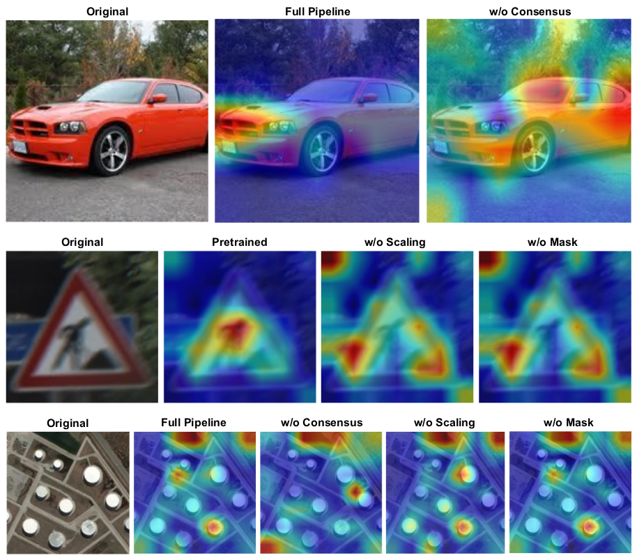

# Multi-Stage Consensus with Layer Scaling for Machine Unlearning

This repository contains the official implementation of the paper **"Multi-Stage Consensus with Layer Scaling for Machine Unlearning"**.

Our unlearning pipeline extracts task vectors from a pool of models fine-tuned under different hyperparameters, filters out intra-task optimization noise via a signal-to-deviation ratio mask and sign consensus, applies layer-wise adaptive scaling to prevent deeper blocks from being disrupted or under-corrected, and runs a two-phase search to find the optimal deletion configuration.

---

## 📖 Methodology Overview

### 1. Overall Pipeline Architecture
Below is the system architecture of our proposed unlearning approach:


*(For full vector graphics and high resolution, open the PDF under [images/overall_architecture.pdf](images/overall_architecture.pdf))*

The pipeline consists of **four distinct stages**:

1. **Stage 1: Task Vector Extraction**
   Extract raw weight updates (task vectors) from a pool of $n$ models fine-tuned on the forget set:
   $$\tau_i = \theta_i - \theta_0$$
   Compute the consensus reference direction:
   $$\bar{\tau} = \frac{1}{n} \sum_{i=1}^{n} \tau_i$$

2. **Stage 2: Filtering parameters using a Signal-to-Deviation Ratio and Sign-Consensus**
   Isolate stable updates by comparing the signal strength to the consensus deviation:
   $$m_{ij} = \mathbf{1}\!\left[\frac{|\tau_{ij}|}{|\tau_{ij} - \bar{\tau}_j| + \varepsilon} > \lambda\right]$$
   Then, track signs of active weights and enforce directional consensus. In the **unanimous** regime:
   $$\text{sign\_pass}_j = \mathbf{1}\!\left[|\text{sign\_sum}_j| = a_j\right]$$
   In the **majority** regime:
   $$\text{sign\_pass}_j = \mathbf{1}\!\left[|\text{sign\_sum}_j| \ge k_{\min}\right]$$
   where $k_{\min} = \max(2, \lfloor r \cdot n \rfloor)$. The combined consensus merged vector $\tau^*$ is:
   $$\tau^*_j = \begin{cases} \frac{1}{a_j} \sum_{i=1}^{n} \tau_{ij} \cdot m_{ij}, & \text{if } a_j \geq k_{\min} \text{ and } \text{sign\_pass}_j = 1 \\ 0, & \text{otherwise} \end{cases}$$

3. **Stage 3: Layer-wise Adaptive Scaling**
   Mitigate transformer block norm heterogeneity by rescaling layers using an inverse-norm scalar:
   $$\gamma_l = \frac{1}{\big(\|\tau^*_l\|_2 + \varepsilon\big)^\beta}$$
   $$\tau^*_l \leftarrow \gamma_l \cdot \tau^*_l$$
   The exponent $\beta \in [0, 1]$ controls the normalization strength, balancing representation updates across different network depths.

4. **Stage 4: Modular Configuration Search**
   First, we sweep negation coefficients $\alpha$ to find:
   $$\theta_{\text{unlearn}} = \theta_0 - \alpha \cdot \tau^*_{\text{scaled}}$$
   Optionally, per-block scaling factors can be fine-tuned via Coordinate Descent:
   $$\theta_{\text{unlearn}} = \theta_0 - \sum_{l} \alpha_l \cdot \tau^{*\,(l)}_{\text{scaled}}$$

---

## 📊 Qualitative Heatmap Visualizations
Our multi-stage consensus keeps parameter density focused. The heatmap below displays how the ratio filter and consensus rules isolate task-specific knowledge compared to individual checkpoints:


*(Located in [images/heatmaps.png](images/heatmaps.png))*

---

## 🚀 Quickstart & Setup

### 1. Installation
Clone the repository, ensure Python 3.8+ and PyTorch (>=1.13) are installed, and install requirements:
```bash
pip install -r requirements.txt
```

### 2. Prepare Checkpoints & Accuracies
- **Pretrained Weights**: Place the zero-shot model (e.g. `zeroshot_ViT-B-32.pt`) under `./models/`.
- **Finetuned Checkpoints**: Place the checkpoints in directories under `./models/CLIP_MU/`.
- **Zero-shot Accuracies**: Bundle the baseline json accuracy file in the root (e.g. `zeroshot_accuracies_ViT-B-32.json`).

*For dataset layout guidelines, check [data/README.md](file:///Users/grady/Documents/research-internship/src/ModularConsensusUnlearning/data/README.md).*

### 3. Run Unlearning

To execute the unlearning search pipeline on the `MNIST` forget task using a `ViT-B-32` backbone:

#### Standard Random Search Sweep (Recommended)
This runs the two-phase random search with global exploration followed by local refinement (sampling 80 configurations):
```bash
python run_unlearning.py \
    --model ViT-B-32 \
    --forget_dataset MNIST \
    --retain_dataset ImageNet \
    --n_random_search 80 \
    --results_dir ./results
```

#### Exhaustive Grid Search Sweep
To search the full hyperparameter grid of consensus ratios, thresholds, and scaling exponents:
```bash
python run_unlearning.py \
    --model ViT-B-32 \
    --forget_dataset MNIST \
    --n_random_search 0 \
    --results_dir ./results
```

#### Layer-wise Coordinate Descent Refinement
To refine layer-wise coefficients iteratively after finding the global parameters:
```bash
python run_unlearning.py \
    --model ViT-B-32 \
    --forget_dataset MNIST \
    --use_cd \
    --cd_passes 1 \
    --results_dir ./results
```

---

## 📈 Outputs
After completion, the following results are saved inside `./results/standard/ViT-B-32/MNIST/`:
- `unlearned_model_MNIST_ViT-B-32.pt`: The unlearned Vision Transformer image encoder model.
- `unlearning_results.json`: Summary report containing the optimal validation and test accuracy scores.
- `coarse_history.csv` / `fine_history.csv`: Sweep logs of all evaluated negation coefficients.
- `unlearning_optimization_curve_MNIST_ViT-B-32.pdf`: Optimization curve plotting forget/retain accuracy sweeps.
